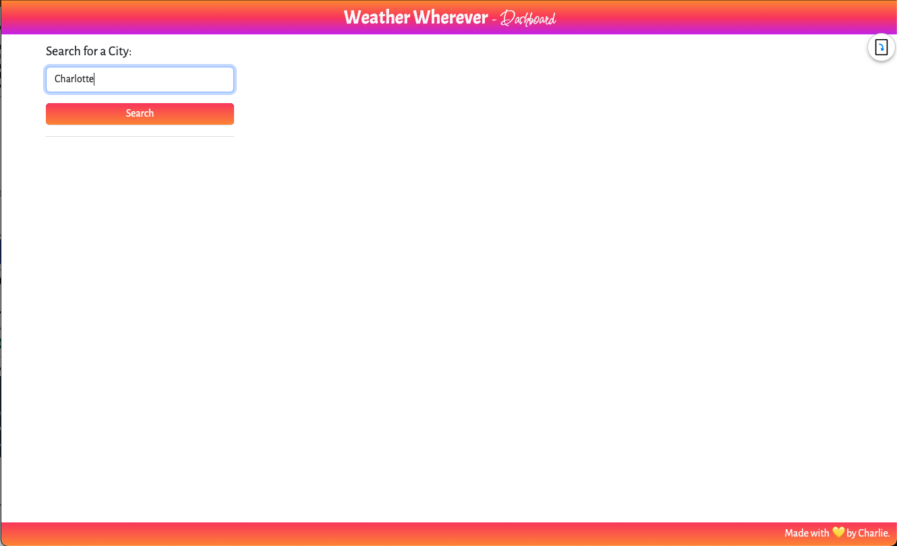
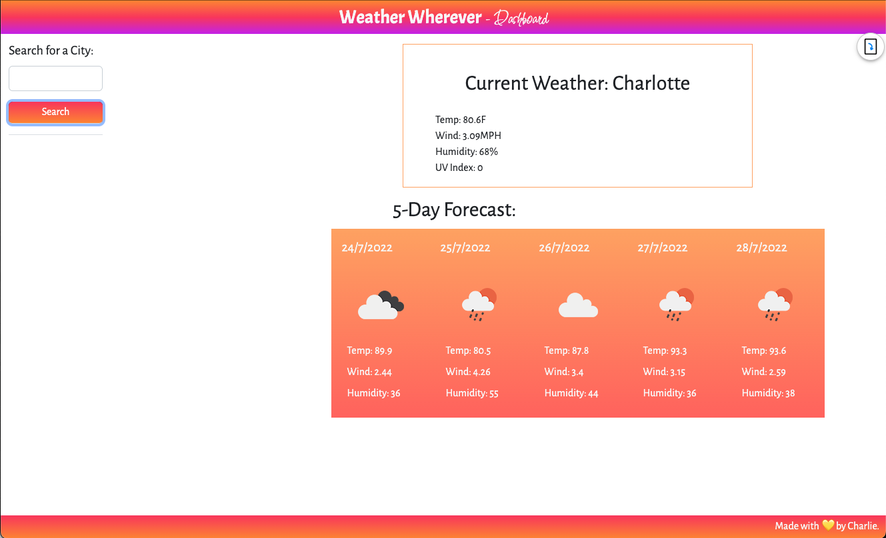

# <weather-wherever>

## Description

Weather Wherever is an IN-PROGRESS responsive weather dashboard where users may enter the name of a city and see the current weather and five day forecast for that city. The user target is adults who travel and may need to see multiple cities weather data in order to plan their travel accordingly. Weather Wherever presents the user with the weather conditions, temperature, humidity, wind speed, and the UV index for the current day.

## Issues

Currently, the functionality of the UV Index color guide and the functionality of the ability to store information and save buttons for previously seen cities is in progress. The normal search function and weather display are functioning, however.

## Usage

Link to Deploy application: https://charliec1665.github.io/weather-dash/

Users enter a city name into the search.
< /br>
< /br>

< /br>
< /br>
< /br>
Users can see current weather conditions and the five day forecast.
< /br>
< /br>

## Credits

Created with love, by me, Charlie.
You can see more of my work here, on GitHub: https://github.com/charliec1665